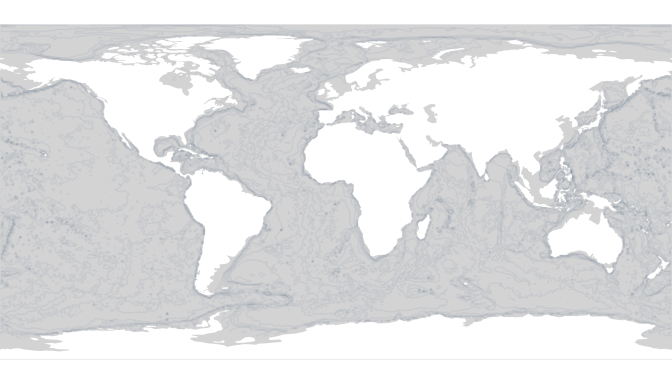

# README


<!-- README.md is generated from README.qmd. Please edit that file -->

# obisrecipes

> **Internal use only.** This package is developed for the [OBIS
> Secretariat](https://obis.org) and OBIS nodes. The API may change
> without notice as internal workflows evolve.

`obisrecipes` is an R package of reusable visualization and mapping
functions for [Ocean Biodiversity Information System
(OBIS)](https://obis.org) data. It covers three areas:

- **ggplot2 styles** — a light theme, a dark marine theme,
  colorblind-safe color scales, a horizontal colourbar guide, and an
  OBIS/IOC logo overlay.
- **Static maps** — ggplot2-based world basemaps, grid converters
  (geohash, H3, A5), and an occurrence layer for plotting species
  distributions.
- **Dynamic maps** — interactive WebGL maps via `mapgl`, a DeckGL H3
  hexagon widget, and helpers for adding species data and map controls.

## Installation

Install the development version from GitHub:

``` r
# install.packages("pak")
pak::pak("iobis/obis-recipes")
```

## Quick start

### ggplot2 styles

``` r
library(obisrecipes)
library(ggplot2)

ggplot(iris, aes(Sepal.Length, Petal.Length, color = Species)) +
    geom_point(size = 2.5) +
    scale_color_obis_cat() +
    labs(title = "Iris measurements by species",
         x = "Sepal length", y = "Petal length") +
    theme_obis(legend_position = "bottom")
```


### Static maps

``` r
grey_map_s()
```



### Dynamic maps

Dynamic maps require an internet connection and render as interactive
widgets. Run interactively in RStudio or embed in R Markdown / Quarto
documents:

``` r
grey_map() |>
    add_species_data(taxonid = 126436, legend = TRUE)
```

## Vignettes

| Vignette | Topic |
|----|----|
| `vignette("ggplot-styles",  package = "obisrecipes")` | Themes, color scales, colourbar guide, logo overlay |
| `vignette("static-maps",    package = "obisrecipes")` | Basemaps, grid converters, offline and API-based plotting |
| `vignette("dynamic-maps",   package = "obisrecipes")` | Interactive WebGL maps and the H3 widget |

## Development

``` r
# Load all functions without installing
devtools::load_all(".")

# Render README
devtools::build_readme()

# Build vignettes
devtools::build_vignettes()
```

====

Developed by the [OBIS Secretariat](https://obis.org) · Hosted under the
[Intergovernmental Oceanographic Commission
(IOC)](https://www.ioc.unesco.org) of UNESCO.
