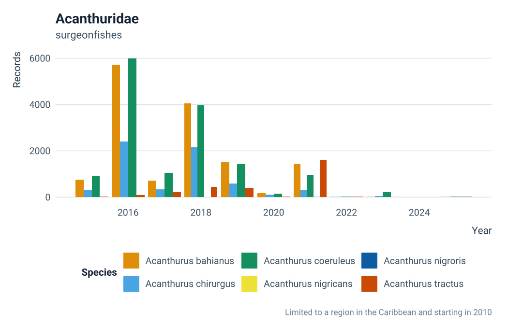
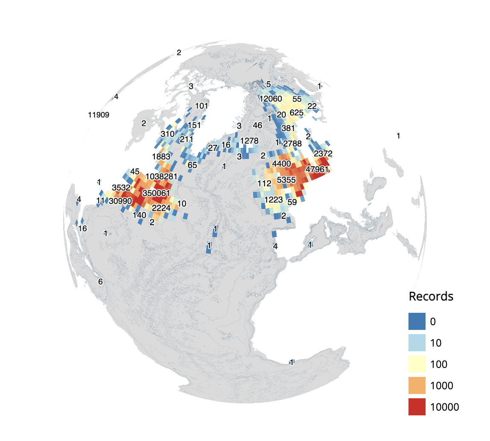
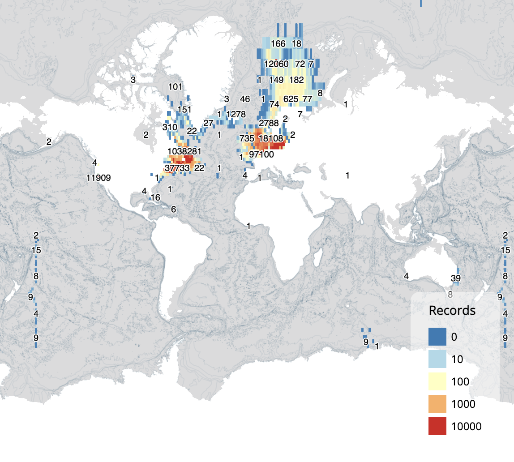
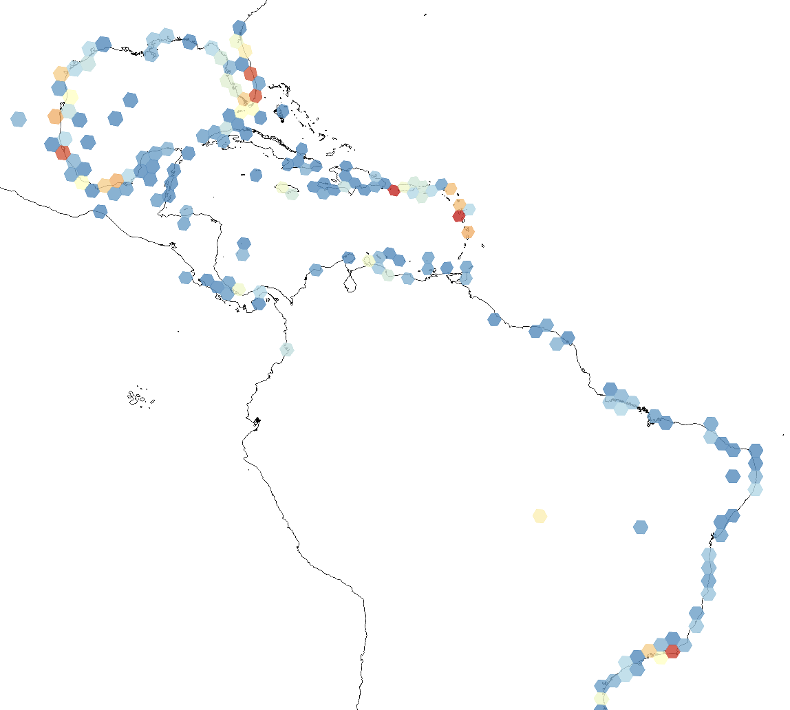
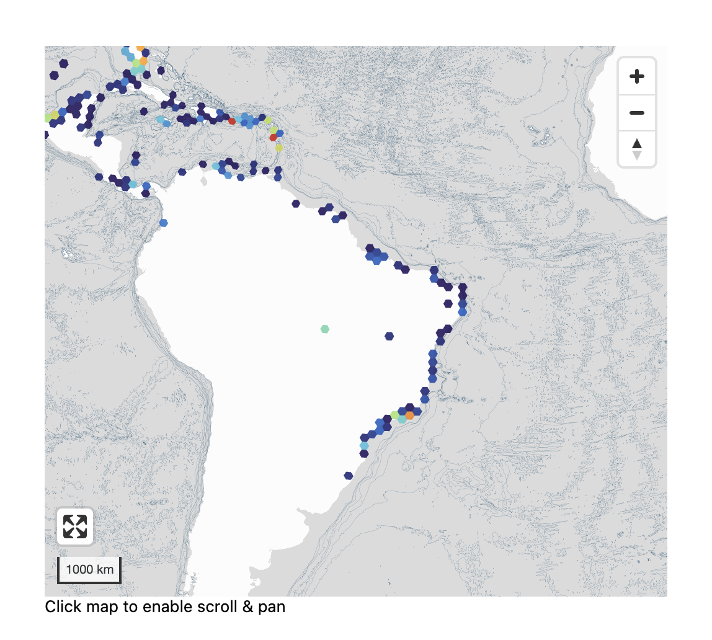
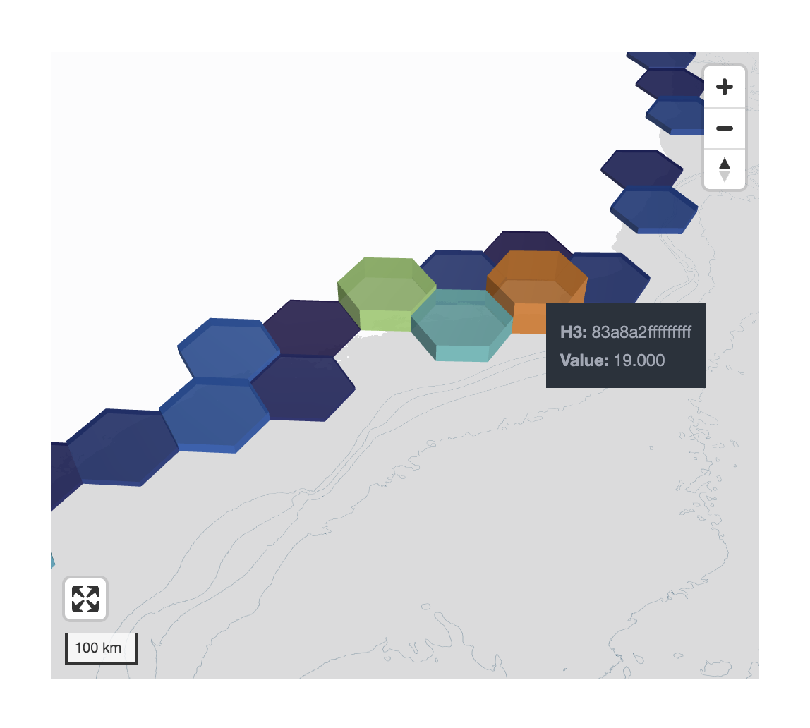

<!-- README.md is generated from README.qmd. Please edit that file -->

# obisrecipes

> **Internal use only.** This package is developed for the [OBIS
> Secretariat](https://obis.org) and OBIS nodes. The API may change
> without notice as internal workflows evolve.

`obisrecipes` is an R package of reusable visualization and mapping
functions for [Ocean Biodiversity Information System
(OBIS)](https://obis.org) data. It covers three areas:

- **ggplot2 styles** — a light theme, a dark marine theme,
  colorblind-safe color scales, a horizontal colourbar guide, and an
  OBIS/IOC logo overlay.
- **Static maps** — ggplot2-based world basemaps, grid converters
  (geohash, H3, A5), and an occurrence layer for plotting species
  distributions.
- **Dynamic maps** — interactive WebGL maps via `mapgl`, a DeckGL H3
  hexagon widget, and helpers for adding species data and map controls.

## Installation

Install the development version from GitHub:

``` r
# install.packages("pak")
pak::pak("iobis/obis-recipes")
```

## Quick start

### ggplot2 styles

``` r
library(obisrecipes)
library(ggplot2)
library(robis)
suppressPackageStartupMessages(library(dplyr))
obis_load_fonts() # Call once per session

occ_acch <- occurrence(taxonid = 159580, startdate = "2010-01-01")
#> 
Retrieved 5000 records of approximately 20018 (24%)
Retrieved 10000 records of
#> approximately 20018 (49%)
Retrieved 15000 records of approximately 20018
#> (74%)
Retrieved 20000 records of approximately 20018 (99%)
Retrieved 20018
#> records of approximately 20018 (100%)

ggplot(occ_acch, aes(sst, depth)) +
    geom_point(size = 2.5, color = "#188eb6", alpha = .2) +
    scale_color_obis_cat() +
    labs(title = "Acanthurus chirurgus",
         subtitle = "doctorfish",
         x = "SST", y = "Depth (in m)") +
    theme_obis(legend_position = "bottom")
#> Warning: Removed 881 rows containing missing values or values outside the scale range
#> (`geom_point()`).
```


``` r
occ_acan <- occurrence(
    taxonid = 125515, startdate = "2015-01-01",
    geometry = "POLYGON ((-81.5625 31.653381, -97.910156 30.448674,
                        -99.492188 21.125498, -92.460937 16.636192,
                         -83.847656 11.005904, -74.707031 7.188101,
                          -58.710938 7.536764, -52.910156 13.068777,
                           -61.171875 28.767659, -73.125 34.016242,
                            -81.5625 31.653381))"
)
#> 
Retrieved 5000 records of approximately 38569 (12%)
Retrieved 10000 records of
#> approximately 38569 (25%)
Retrieved 15000 records of approximately 38569
#> (38%)
Retrieved 20000 records of approximately 38569 (51%)
Retrieved 25000
#> records of approximately 38569 (64%)
Retrieved 30000 records of approximately
#> 38569 (77%)
Retrieved 35000 records of approximately 38569 (90%)
Retrieved 38569
#> records of approximately 38569 (100%)

occ_acan_agg <- occ_acan |>
    group_by(date_year, species) |>
    summarise(Records = n()) |>
    rename(Year = date_year, Species = species) |>
    filter(!is.na(Species))
#> `summarise()` has regrouped the output.
#> ℹ Summaries were computed grouped by date_year and species.
#> ℹ Output is grouped by date_year.
#> ℹ Use `summarise(.groups = "drop_last")` to silence this message.
#> ℹ Use `summarise(.by = c(date_year, species))` for per-operation grouping
#>   (`?dplyr::dplyr_by`) instead.

ggplot(occ_acan_agg, aes(Year, Records, fill = Species)) +
    geom_bar(stat = "identity", position="dodge") +
    scale_fill_obis_cat() +
    labs(title = "Acanthuridae",
         subtitle = "surgeonfishes",
         caption = "Limited to a region in the Caribbean and starting in 2010",
         x = "Year", y = "Records") +
    theme_obis(legend_position = "bottom")
```



### Colorbars

``` r
sst_caribbean_bo <- terra::rast(
    "https://erddap.bio-oracle.org/erddap/griddap/thetao_baseline_2000_2019_depthsurf.nc?thetao_mean%5B(2010-01-01T00:00:00Z):1:(2010-01-01T00:00:00Z)%5D%5B(0.025):1:(43.025)%5D%5B(-103.975):1:(-37.975)%5D"
)

sst_caribbean_bo <- terra::aggregate(sst_caribbean_bo, 4) |>
    as.data.frame(xy = T)

ggplot(sst_caribbean_bo) +
    geom_raster(aes(x = x, y = y, fill = thetao_mean)) +
    scale_fill_obis_cont(palette = "thermal") +
    guides(fill = guide_colourbar_h(title = "Temperature (°C)",
                                    barwidth = grid::unit(14, "lines"))) +
    labs(x = NULL, y = NULL, title = "Sea surface temperature - average") +
    scale_x_continuous(expand = F) +
    scale_y_continuous(expand = F) +
    theme_obis(legend_position = "bottom") +
    theme(panel.grid = element_blank()) +
    coord_equal()
```


``` r
ggplot(sst_caribbean_bo) +
    geom_raster(aes(x = x, y = y, fill = thetao_mean)) +
    scale_fill_obis_cont(palette = "thermal") +
    guides(fill = guide_colourbar_h(title = "Temperature (°C)",
                                    barwidth = grid::unit(14, "lines"))) +
    labs(x = NULL, y = NULL, title = "Sea surface temperature - average") +
    scale_x_continuous(expand = F) +
    scale_y_continuous(expand = F) +
    theme_obis_dark(legend_position = "bottom") +
    theme(panel.grid = element_blank()) +
    coord_equal()
```


### Static maps

``` r
grey_map_s()
```


Focused regional view with gridded occurrence data:

``` r
grey_map_s() |>
    add_species_data_s(
        grid_data     = occ_to_geohashgrid(occ_acch, grid_res = 3),
        limit_by_bbox = FALSE,
        plot_xlim     = c(-90, -34),
        plot_ylim     = c(-28, 43)
    )
#> Coordinate system already present.
#> ℹ Adding new coordinate system, which will replace the existing one.
```


### Dynamic maps

Dynamic maps require an internet connection and render as interactive
widgets. Run interactively in RStudio or embed in R Markdown / Quarto
documents:

``` r
grey_map() |>
    add_species_data(taxonid = 126436, legend = TRUE)
```



``` r
grey_map(projection = "mercator") |>
    add_species_data(taxonid = 126436, legend = TRUE)
```



Using H3 grid (first example uses h3j source from the [`mapgl`
package](https://walker-data.com/mapgl/reference/add_h3j_source.html),
and is not suitable for very large datasets. For larger datasets uses
the H3 DeckGL widget, the second and third examples).

``` r
library(duckdb)
library(h3jsr)
library(dplyr)

con <- dbConnect(duckdb())

df <- dbGetQuery(con, "
    SELECT records, cell
    FROM read_parquet('s3://obis-products/speciesgrids/h3_7/*')
    WHERE species = 'Minuca rapax'
")

df <- df |>
    mutate(h3 = h3jsr::get_parent(cell, 3)) |>
    group_by(h3) |>
    summarise(value = sum(records))

# inline H3
blank_map(projection = "mercator") |>
    add_h3j_source_inline("h3source", df = df, h3_col = "h3") |>
    mapgl::add_fill_layer(
        id           = "h3layer",
        source       = "h3source",
        fill_color   = mapgl::interpolate(
            column = "value",
            values = c(0, 5, 10, 15, 20),
            stops  = c("#2c7bb6", "#abd9e9", "#ffffbf", "#fdae61", "#d7191c")
        ),
        fill_opacity = 0.8
    ) |>
    mapgl::fit_bounds(get_species_extent(taxonid = 955271))

# DeckGL
maplibre_h3(df, center = c(-50, -10), zoom = 2)

# DeckGL with extrusion
maplibre_h3(df, center = c(-50, -10), extruded = TRUE, elevation_scale = 3000)
```







## Vignettes

| Vignette | Topic |
|----|----|
| `vignette("ggplot-styles",  package = "obisrecipes")` | Themes, color scales, colourbar guide, logo overlay |
| `vignette("static-maps",    package = "obisrecipes")` | Basemaps, grid converters, offline and API-based plotting |
| `vignette("dynamic-maps",   package = "obisrecipes")` | Interactive WebGL maps and the H3 widget |

## Development

``` r
# Load all functions without installing
devtools::load_all(".")

# Render README
devtools::build_readme()

# Build vignettes
devtools::build_vignettes()
```

------------------------------------------------------------------------

Developed by the [OBIS Secretariat](https://obis.org) · Operating under the
[Intergovernmental Oceanographic Commission
(IOC)](https://www.ioc.unesco.org) of UNESCO.
