# ggplot2 Styles and Themes

``` r

library(obisrecipes)
library(ggplot2)
```

The `obisrecipes` package ships a complete ggplot2 styling system: two
themes
([`theme_obis()`](https://iobis.github.io/obis-recipes/reference/theme_obis.md)
for light plots and
[`theme_obis_dark()`](https://iobis.github.io/obis-recipes/reference/theme_obis_dark.md)
for a deep-ocean look), colorblind-safe categorical and continuous color
scales, a horizontal colourbar guide, and a helper that overlays the
OBIS + IOC logos on any finished plot.

Load the Roboto font once per session before rendering:

``` r

obis_load_fonts()
```

## Light theme — `theme_obis()`

[`theme_obis()`](https://iobis.github.io/obis-recipes/reference/theme_obis.md)
provides a clean white background with subtle blue-grey accents.

``` r

ggplot(mtcars, aes(wt, mpg)) +
    geom_point(color = "#0072B2", size = 2) +
    labs(title = "Fuel efficiency", subtitle = "Weight vs. miles per gallon",
         x = "Weight (1000 lbs)", y = "MPG") +
    theme_obis()
```

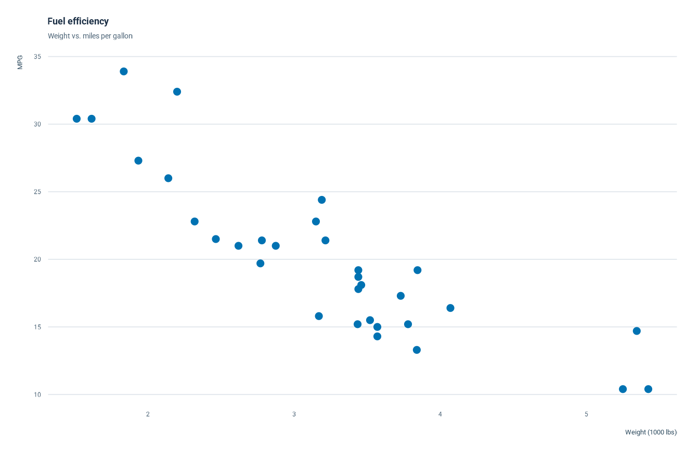

Axis titles are placed at the far end of their axis by default
(`corner_axis_titles = TRUE`). Set it to `FALSE` for centered titles:

``` r

ggplot(mtcars, aes(wt, mpg)) +
    geom_point(color = "#0072B2", size = 2) +
    labs(title = "Fuel efficiency", subtitle = "Weight vs. miles per gallon",
         x = "Weight (1000 lbs)", y = "MPG") +
    theme_obis(corner_axis_titles = FALSE)
```

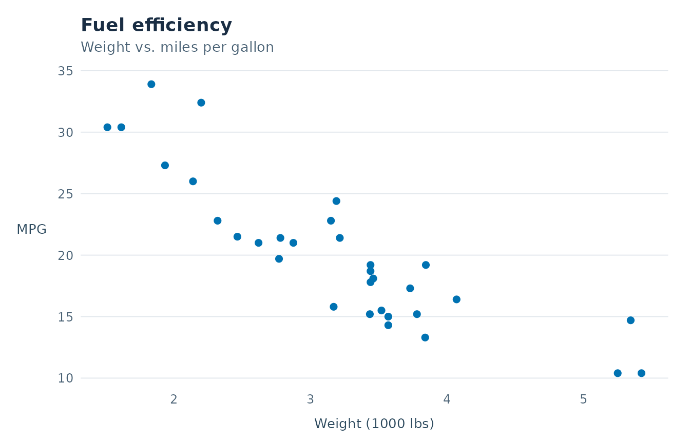

Faceted plots and legend placement also work out of the box:

``` r

ggplot(mtcars, aes(wt, mpg)) +
    geom_point(color = "#0072B2", size = 2) +
    facet_wrap(~cyl) +
    labs(title = "Fuel efficiency by cylinder count") +
    theme_obis()
```

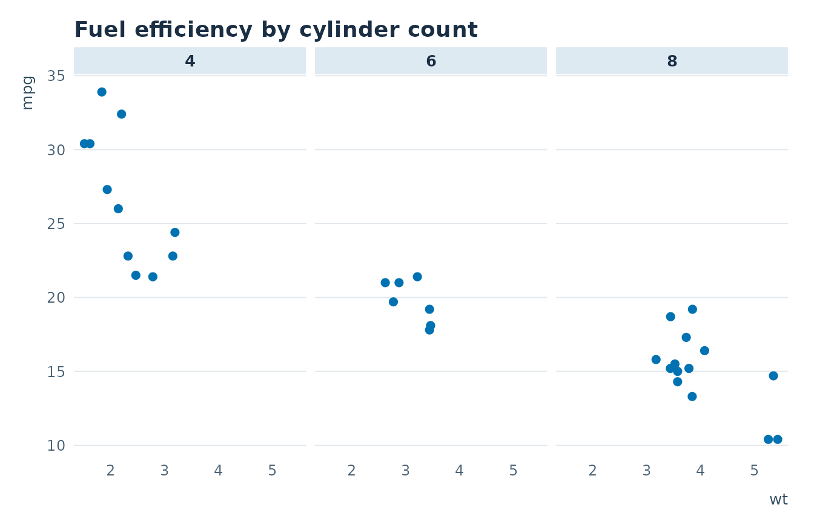

``` r

ggplot(iris, aes(Sepal.Length, Petal.Length, color = Species)) +
    geom_point(size = 2) +
    labs(title = "Iris measurements") +
    theme_obis(legend_position = "bottom")
```

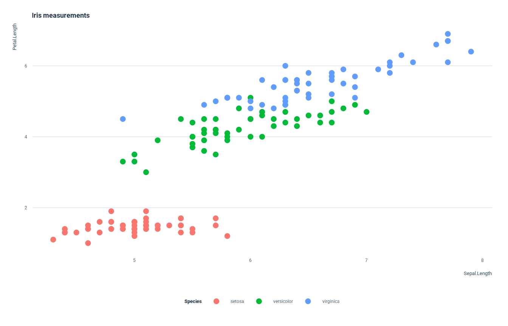

Use `base_size` to scale everything up for presentations:

``` r

ggplot(mtcars, aes(wt, mpg)) +
    geom_point(color = "#009E73", size = 2.5) +
    labs(title = "Presentation-ready", x = "Weight", y = "MPG") +
    theme_obis(base_size = 14)
```

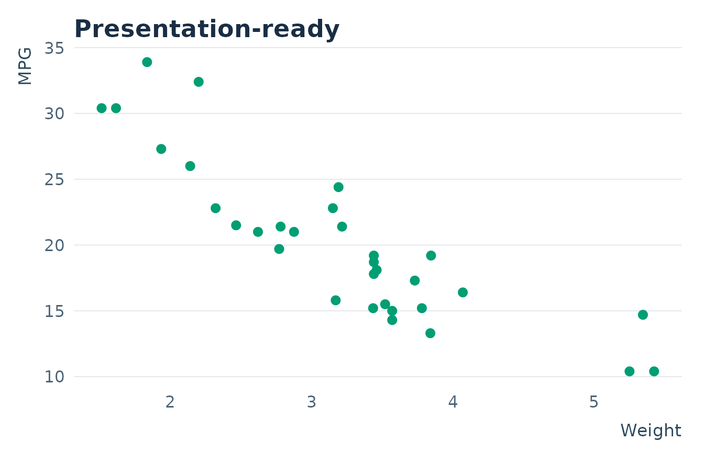

## Dark marine theme — `theme_obis_dark()`

[`theme_obis_dark()`](https://iobis.github.io/obis-recipes/reference/theme_obis_dark.md)
uses a deep navy background that pairs well with the `"mako"`,
`"thermal"`, and `"haline"` continuous scales.

``` r

ggplot(mtcars, aes(wt, mpg)) +
    geom_point(color = "#56B4E9", size = 2) +
    labs(title = "Deep ocean style", subtitle = "Weight vs. miles per gallon",
         x = "Weight (1000 lbs)", y = "MPG") +
    theme_obis_dark()
```

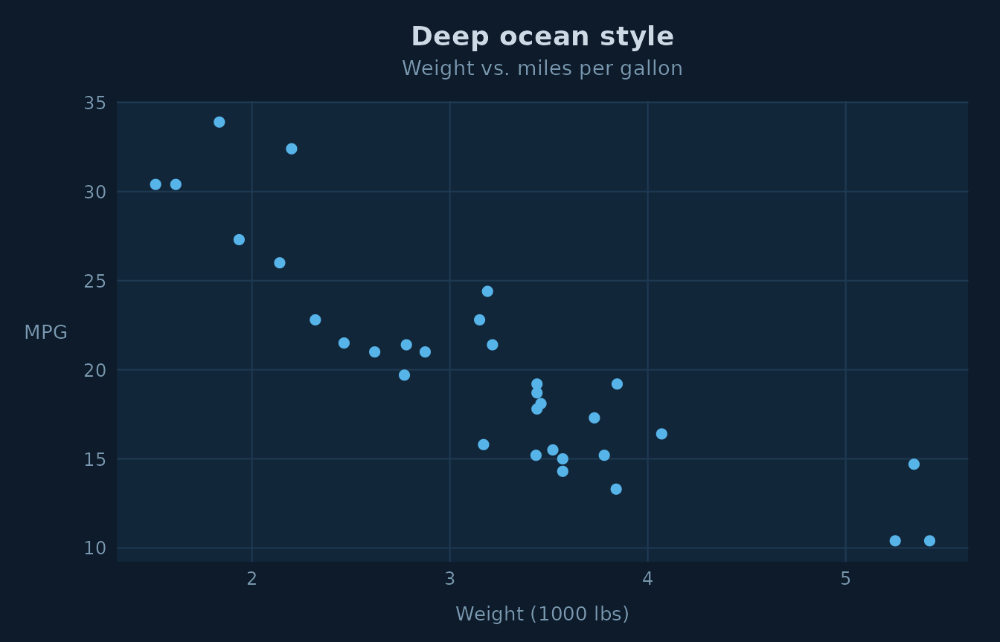

``` r

ggplot(faithfuld, aes(waiting, eruptions, fill = density)) +
    geom_tile() +
    labs(title = "Old Faithful eruption density") +
    scale_fill_obis_cont("thermal") +
    theme_obis_dark(legend_position = "bottom")
```

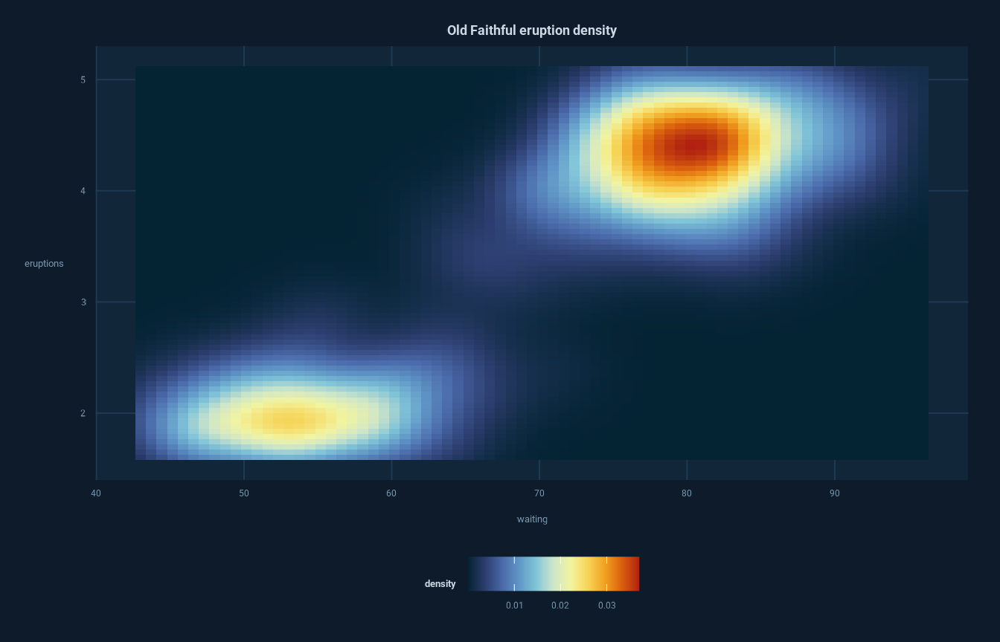

``` r

ggplot(iris, aes(Sepal.Length, Petal.Length, color = Species)) +
    geom_point(size = 2) +
    facet_wrap(~Species) +
    labs(title = "Iris by species") +
    scale_color_obis_cat() +
    theme_obis_dark()
```

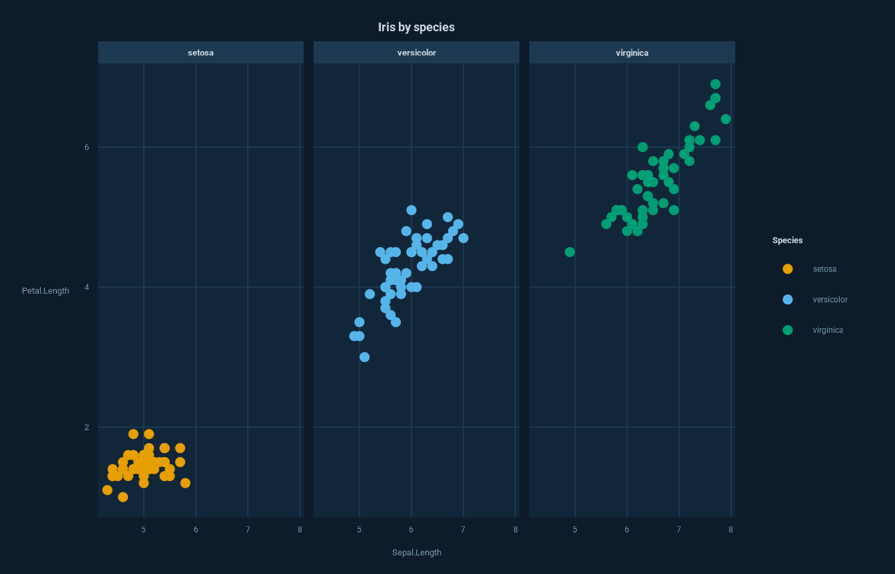

## Publication theme — `theme_obis_pub()`

[`theme_obis_pub()`](https://iobis.github.io/obis-recipes/reference/theme_obis_pub.md)
follows the visual conventions of top scientific journals (Nature,
Science, Cell, One Earth). Key characteristics:

- **L-shaped axes** — bottom and left axis lines only, no box, from
  [`theme_classic()`](https://ggplot2.tidyverse.org/reference/ggtheme.html).
- **Outward tick marks** — black, short (3 pt), with no grid by default.
- **No legend box** — minimal legend with tight spacing.
- **Blank facet strips** — bold label above each panel, no coloured
  background.
- **Compact margins** — reduces whitespace around the plot area.

The default `base_size` is `11`, comfortable for screen preview at
standard figure dimensions (7 × 5 in). Reduce to 7–8 pt for narrow
journal column widths, or let
[`obis_ggsave()`](https://iobis.github.io/obis-recipes/reference/obis_ggsave.md)
handle the scaling automatically.

``` r

ggplot(mtcars, aes(wt, mpg)) +
    geom_point(size = 1.5) +
    labs(title = "Fuel efficiency",
         x = "Weight (1000 lbs)", y = "MPG") +
    theme_obis_pub()
```

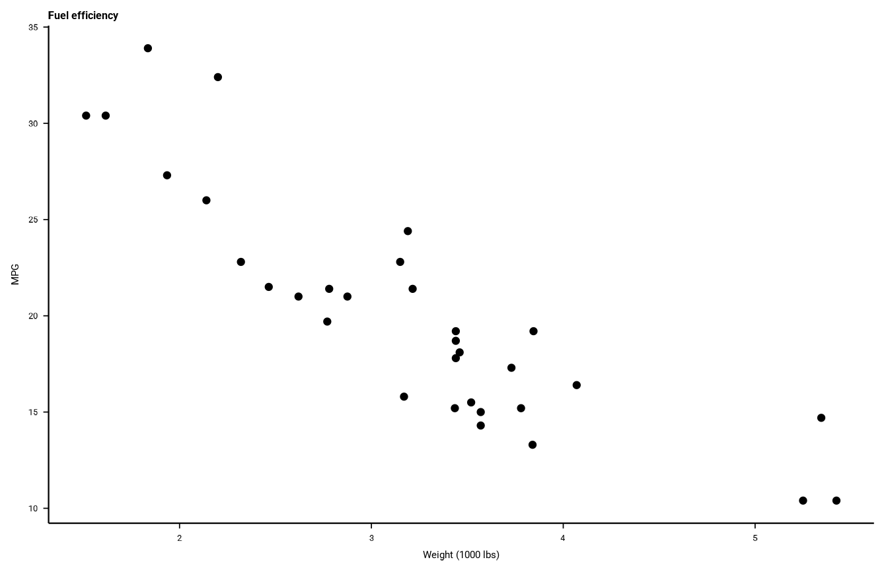

Combine with the colorblind-safe categorical scale and a legend:

``` r

ggplot(iris, aes(Sepal.Length, Petal.Length, color = Species)) +
    geom_point(size = 1.5) +
    scale_color_obis_cat() +
    labs(title = "Iris measurements",
         x = "Sepal length (cm)", y = "Petal length (cm)") +
    theme_obis_pub(legend_position = "bottom")
```

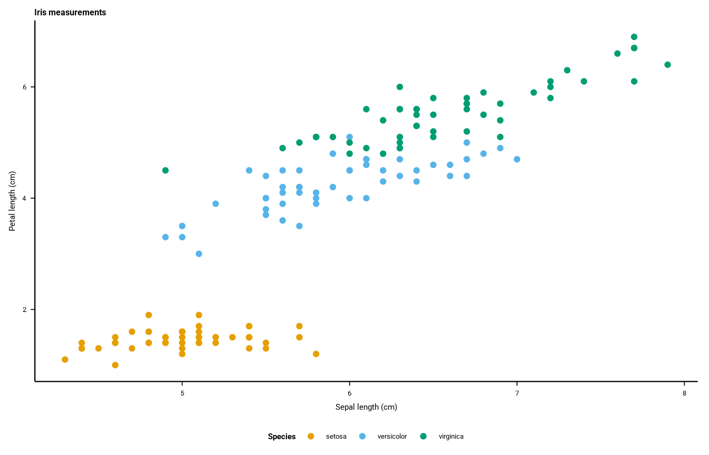

Subtle y-axis reference lines can be enabled with `grid = "y"` for plots
where reading precise values matters:

``` r

ggplot(mtcars, aes(wt, mpg)) +
    geom_point(size = 1.5) +
    labs(title = "With reference lines", x = "Weight (1000 lbs)", y = "MPG") +
    theme_obis_pub(grid = "y")
```

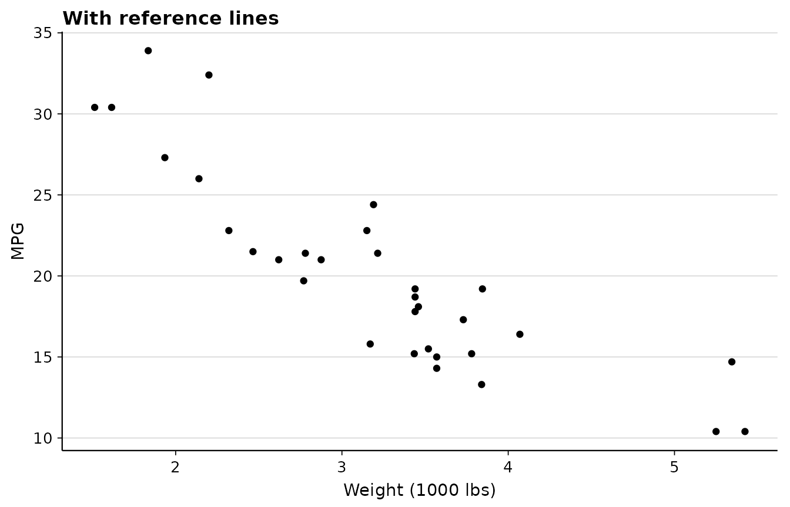

Facets follow the same blank-strip convention used by many journals
(panel labels are typically added later via cowplot or patchwork):

``` r

ggplot(mtcars, aes(wt, mpg)) +
    geom_point(size = 1.5) +
    facet_wrap(~cyl) +
    labs(title = "Fuel efficiency by cylinder count",
         x = "Weight (1000 lbs)", y = "MPG") +
    theme_obis_pub()
```

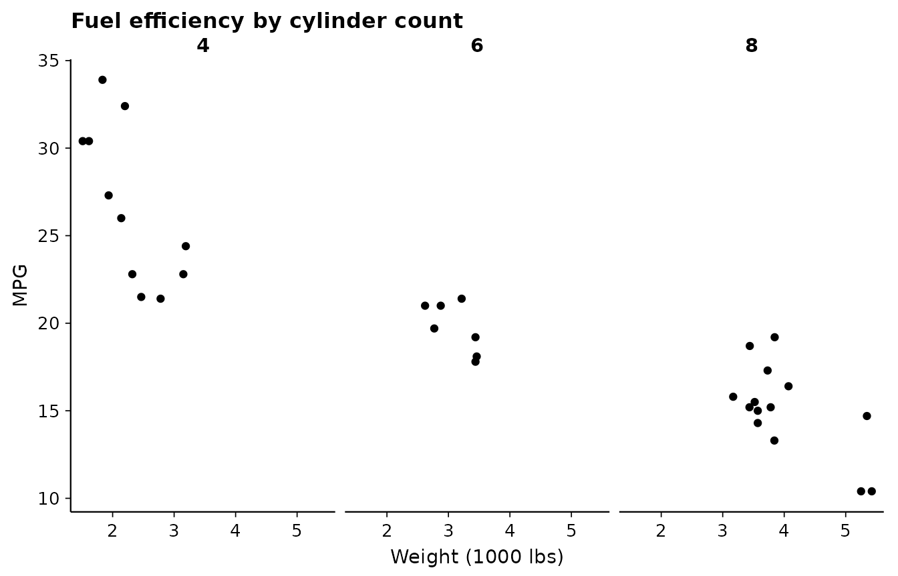

``` r

ggplot(faithfuld, aes(waiting, eruptions, fill = density)) +
    geom_tile() +
    scale_fill_obis_cont("haline") +
    guides(fill = guide_colourbar_h(title = "Density")) +
    labs(x = "Waiting time (min)", y = "Eruption duration (min)") +
    theme_obis_pub(legend_position = "bottom")
```

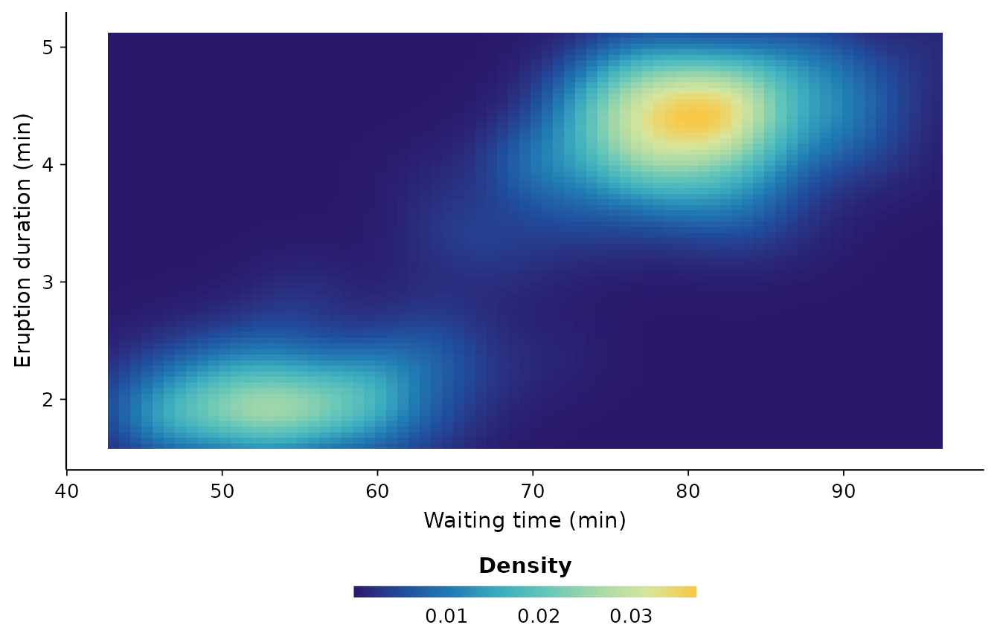

## Saving publication figures — `obis_ggsave()`

A common frustration with
[`ggsave()`](https://ggplot2.tidyverse.org/reference/ggsave.html) is
that text and other theme elements are specified in absolute points, so
they appear proportionally smaller when you save a figure at a larger
physical size.
[`obis_ggsave()`](https://iobis.github.io/obis-recipes/reference/obis_ggsave.md)
fixes this by rendering the plot at a **reference size** (default 7 × 5
in, matching ggplot2’s screen default) and then scaling the canvas to
the target dimensions. Text always occupies the same fraction of the
figure.

The scaling factor is the geometric mean of the area ratio:
$`s = \sqrt{(w \times h)\;/\;(w_\text{ref} \times h_\text{ref})}`$.

``` r

p_pub <- ggplot(iris, aes(Sepal.Length, Petal.Length, color = Species)) +
    geom_point(size = 1.5) +
    scale_color_obis_cat() +
    labs(title = "Iris measurements",
         x = "Sepal length (cm)", y = "Petal length (cm)") +
    theme_obis_pub()

# Single-column journal width (3.5 × 2.5 in) — text scales down proportionally
obis_ggsave("fig1_single.pdf", p_pub, width = 3.5, height = 2.5)

# Double-column (7 × 5 in) — same apparent text size as on screen
obis_ggsave("fig1_double.pdf", p_pub, width = 7, height = 5)

# Poster panel (14 × 10 in) — text scales up, remains legible
obis_ggsave("fig1_poster.pdf", p_pub, width = 14, height = 10)

# PNG for journal submission at 300 dpi
obis_ggsave("fig1.png", p_pub, width = 3.5, height = 2.5, dpi = 300)
```

If your figures are authored at a non-default preview size, adjust
`ref_width` and `ref_height` accordingly:

``` r

# Plot designed for a 5 × 3.5 in RStudio preview
obis_ggsave("fig1.pdf", p_pub, width = 3.5, height = 2.5,
            ref_width = 5, ref_height = 3.5)
```

## Categorical color scales

[`scale_color_obis_cat()`](https://iobis.github.io/obis-recipes/reference/scale_color_obis_cat.md)
and
[`scale_fill_obis_cat()`](https://iobis.github.io/obis-recipes/reference/scale_color_obis_cat.md)
apply one of three colorblind-safe discrete palettes.

### Okabe-Ito (default)

``` r

ggplot(iris, aes(Sepal.Length, Petal.Length, color = Species)) +
    geom_point(size = 2.5) +
    scale_color_obis_cat() +
    labs(title = "Okabe-Ito palette", color = "Species") +
    theme_obis()
```

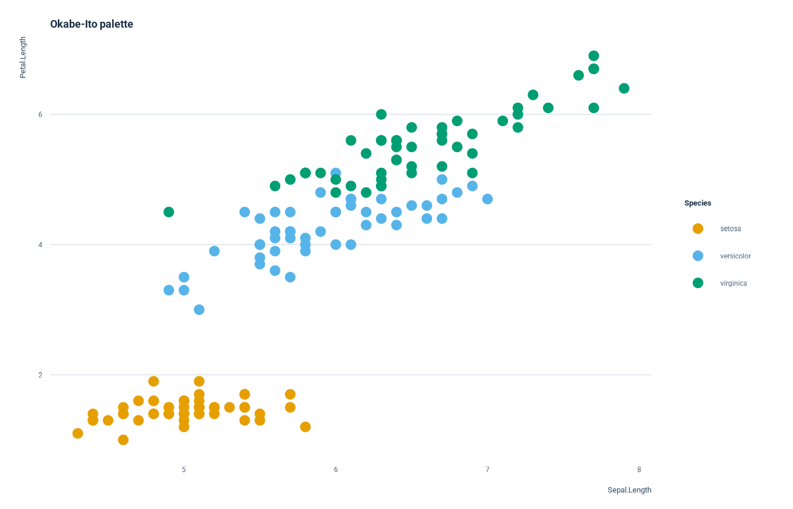

### Paul Tol bright

``` r

ggplot(iris, aes(Sepal.Length, Petal.Length, color = Species)) +
    geom_point(size = 2.5) +
    scale_color_obis_cat(palette = "tol") +
    labs(title = "Tol bright palette", color = "Species") +
    theme_obis()
```

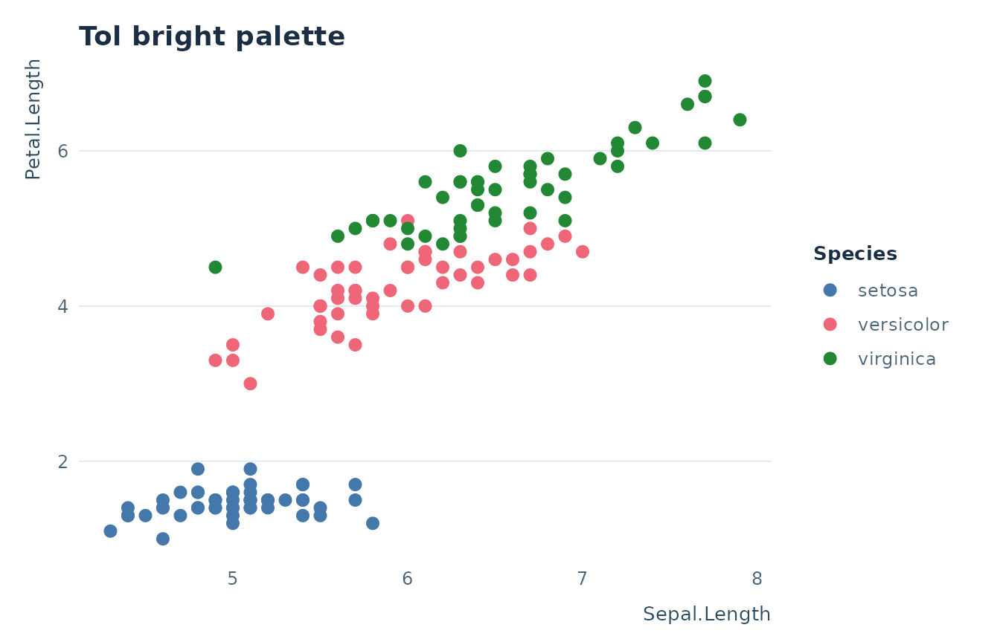

### IBM

IBM’s 5-color palette (blue, purple, magenta, orange, gold) is a good
choice when the number of categories is ≤ 5 and a cooler, more corporate
look is preferred. It works well on both light and dark backgrounds.

``` r

ggplot(iris, aes(Sepal.Length, Petal.Length, color = Species)) +
    geom_point(size = 2.5) +
    scale_color_obis_cat(palette = "ibm") +
    labs(title = "IBM palette", color = "Species") +
    theme_obis()
```

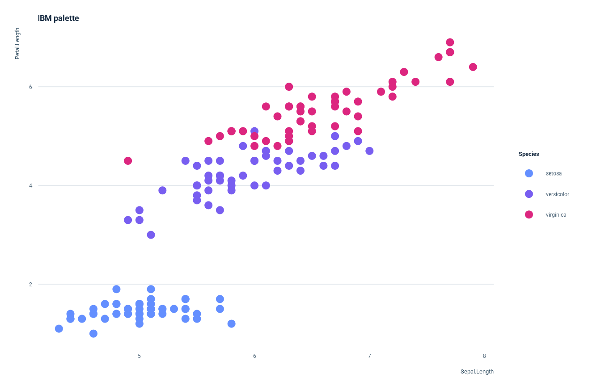

``` r

ggplot(iris, aes(Sepal.Length, Petal.Length, color = Species)) +
    geom_point(size = 2.5) +
    scale_color_obis_cat(palette = "ibm") +
    labs(title = "IBM palette — dark theme", color = "Species") +
    theme_obis_dark()
```

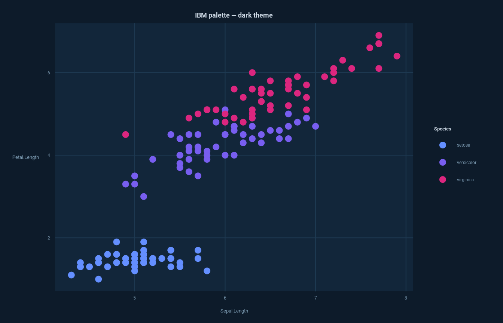

### Fill variants

``` r

ggplot(mpg, aes(class, fill = drv)) +
    geom_bar(position = "dodge") +
    scale_fill_obis_cat() +
    labs(title = "Drive type by vehicle class", x = NULL, fill = "Drive") +
    theme_obis()
```

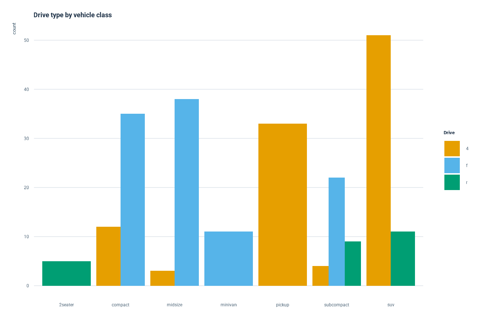

## Continuous color scales

[`scale_fill_obis_cont()`](https://iobis.github.io/obis-recipes/reference/scale_color_obis_cont.md)
and
[`scale_color_obis_cont()`](https://iobis.github.io/obis-recipes/reference/scale_color_obis_cont.md)
offer nine palettes — five multi-hue sequential, two diverging, and two
single-hue sequential:

| Palette     | Origin      | Recommended for                            |
|-------------|-------------|--------------------------------------------|
| `"mako"`    | viridis     | abundance, density                         |
| `"cividis"` | viridis     | general-purpose (CVD-optimized)            |
| `"thermal"` | cmocean     | sea surface temperature                    |
| `"haline"`  | cmocean     | salinity                                   |
| `"deep"`    | cmocean     | depth / bathymetry                         |
| `"rdbu"`    | ColorBrewer | diverging: blue → white → red              |
| `"prgn"`    | ColorBrewer | diverging: purple → white → green          |
| `"blues"`   | ColorBrewer | single-hue sequential (light → dark blue)  |
| `"greens"`  | ColorBrewer | single-hue sequential (light → dark green) |

``` r

ggplot(faithfuld, aes(waiting, eruptions, fill = density)) +
    geom_tile() +
    scale_fill_obis_cont("mako") +
    labs(title = "Mako — density", x = "Waiting (min)", y = "Eruption (min)") +
    theme_obis()
```

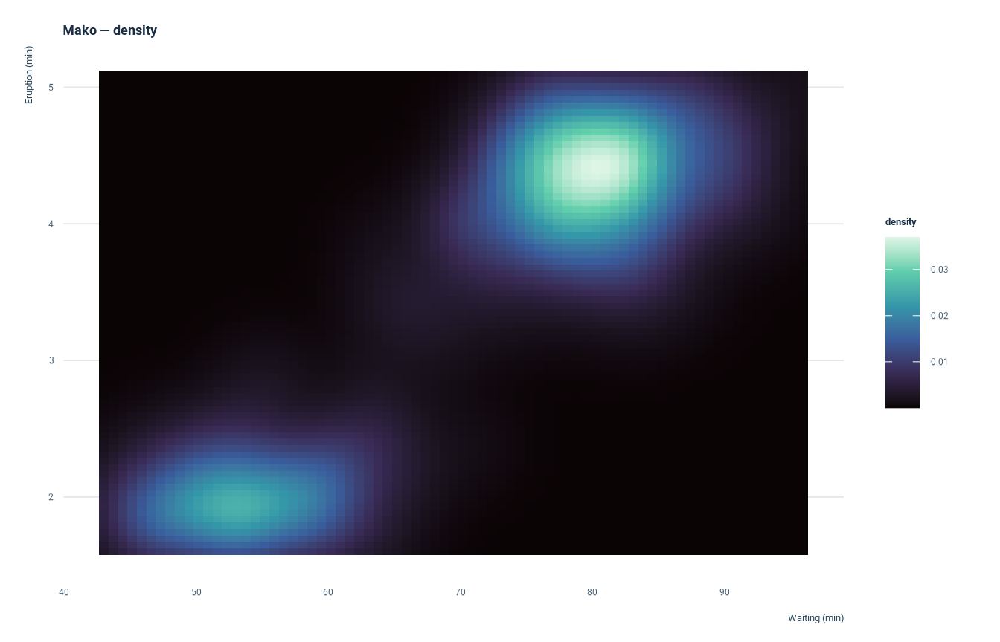

``` r

ggplot(faithfuld, aes(waiting, eruptions, fill = density)) +
    geom_tile() +
    scale_fill_obis_cont("thermal") +
    labs(title = "Thermal — SST style") +
    theme_obis_dark()
```

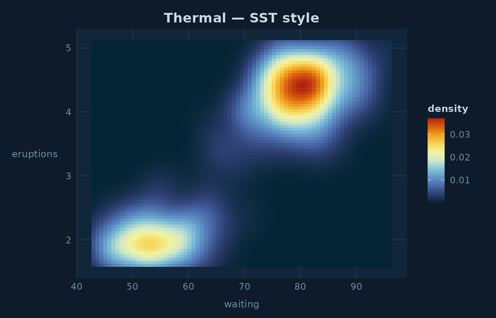

``` r

ggplot(faithfuld, aes(waiting, eruptions, fill = density)) +
    geom_tile() +
    scale_fill_obis_cont("haline") +
    labs(title = "Haline — salinity style") +
    theme_obis()
```

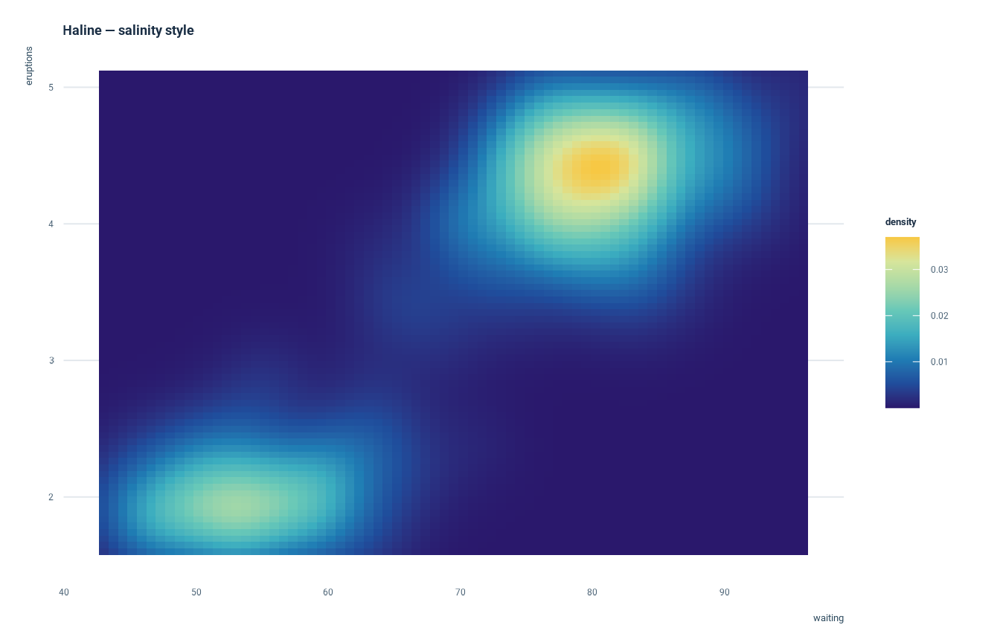

``` r

ggplot(faithfuld, aes(waiting, eruptions, fill = density)) +
    geom_tile() +
    scale_fill_obis_cont("deep", direction = -1) +
    labs(title = "Deep — bathymetry style (reversed)") +
    theme_obis()
```

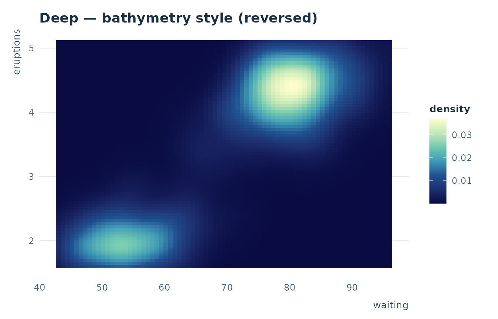

### Diverging palettes

Diverging palettes are suited to data with a meaningful midpoint (zero,
a reference temperature, a species mean, etc.). Both are 11-stop
ColorBrewer palettes with a white neutral centre.

``` r

ggplot(faithfuld, aes(waiting, eruptions, fill = density)) +
    geom_tile() +
    scale_fill_obis_cont("rdbu") +
    labs(title = "RdBu — blue to red", x = "Waiting (min)", y = "Eruption (min)") +
    theme_obis()
```

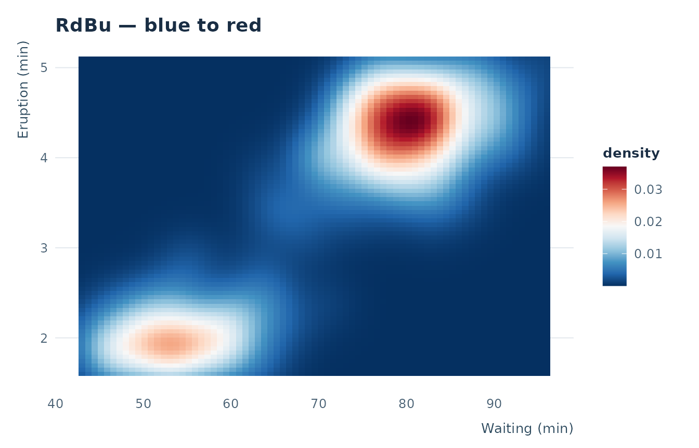

``` r

ggplot(faithfuld, aes(waiting, eruptions, fill = density)) +
    geom_tile() +
    scale_fill_obis_cont("prgn") +
    labs(title = "PRGn — purple to green", x = "Waiting (min)", y = "Eruption (min)") +
    theme_obis()
```

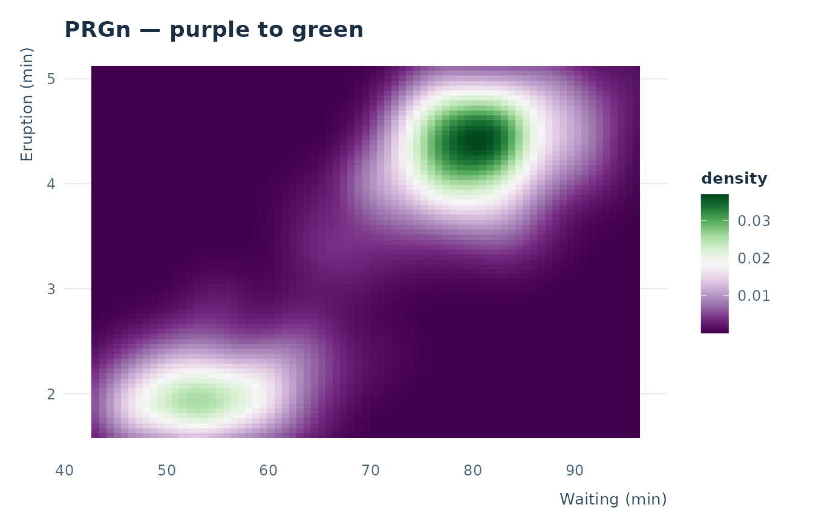

### Single-hue sequential palettes

`"blues"` and `"greens"` are 9-stop ColorBrewer palettes running from a
near- white tint to a rich dark hue. They work well whenever a single
variable needs to be highlighted without introducing hue contrast — for
example, highlighting species richness or chlorophyll concentration on a
neutral basemap.

``` r

ggplot(faithfuld, aes(waiting, eruptions, fill = density)) +
    geom_tile() +
    scale_fill_obis_cont("blues") +
    labs(title = "Blues", x = "Waiting (min)", y = "Eruption (min)") +
    theme_obis()
```

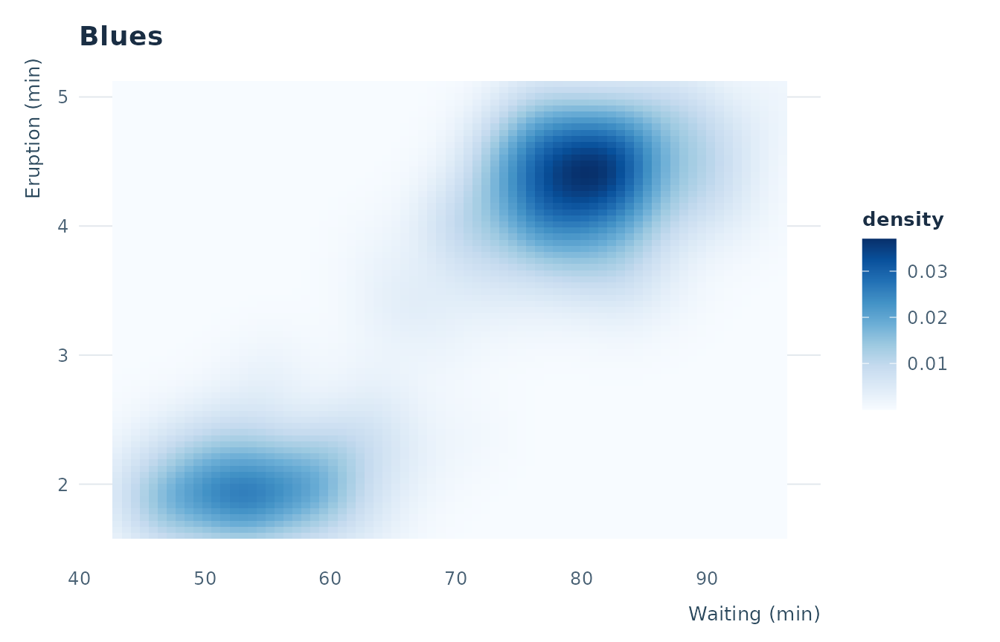

``` r

ggplot(faithfuld, aes(waiting, eruptions, fill = density)) +
    geom_tile() +
    scale_fill_obis_cont("greens") +
    labs(title = "Greens", x = "Waiting (min)", y = "Eruption (min)") +
    theme_obis()
```

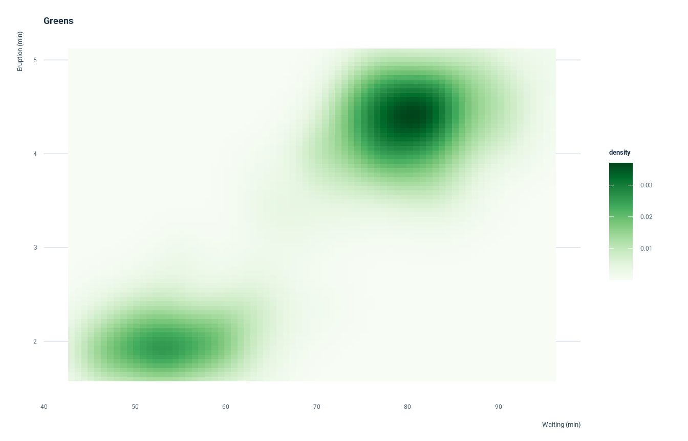

Use `direction = -1` to reverse any palette. The scales also work on the
`color` aesthetic for scatter plots:

``` r

ggplot(mtcars, aes(wt, mpg, color = hp)) +
    geom_point(size = 3) +
    scale_color_obis_cont("haline") +
    labs(title = "Continuous color on points", color = "Horsepower") +
    theme_obis()
```

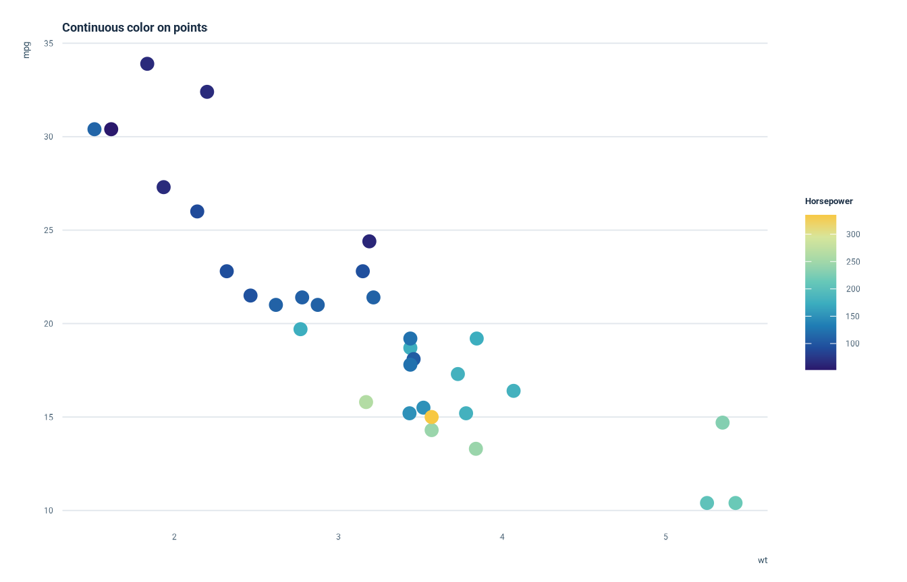

## Horizontal colourbar — `guide_colourbar_h()`

[`guide_colourbar_h()`](https://iobis.github.io/obis-recipes/reference/guide_colourbar_h.md)
returns a thin horizontal colourbar styled similarly to matplotlib’s
default. Use it with
[`guides()`](https://ggplot2.tidyverse.org/reference/guides.html) when
placing the legend at the bottom.

``` r

ggplot(faithfuld, aes(waiting, eruptions, fill = density)) +
    geom_tile() +
    scale_fill_obis_cont("thermal") +
    guides(fill = guide_colourbar_h(title = "Density")) +
    labs(title = "Horizontal colourbar", x = "Waiting (min)", y = "Eruption (min)") +
    theme_obis(legend_position = "bottom")
```

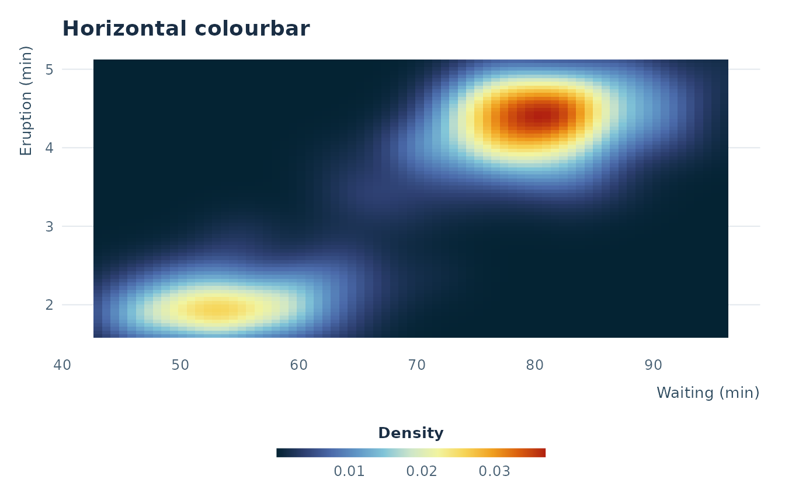

Adjust width and title position as needed:

``` r

ggplot(faithfuld, aes(waiting, eruptions, fill = density)) +
    geom_tile() +
    scale_fill_obis_cont("haline") +
    guides(fill = guide_colourbar_h(
        title          = "Density",
        barwidth       = grid::unit(16, "lines"),
        title_position = "bottom",
        title_hjust    = 0
    )) +
    labs(title = "Wider bar, bottom title") +
    theme_obis(legend_position = "bottom")
```

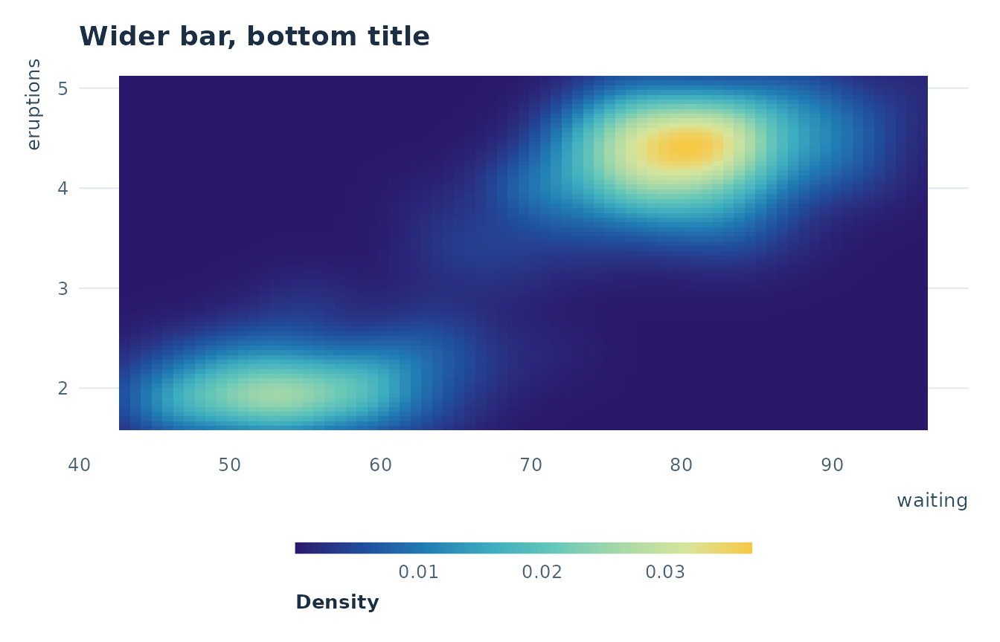

``` r

ggplot(faithfuld, aes(waiting, eruptions, fill = density)) +
    geom_tile() +
    scale_fill_obis_cont("mako") +
    guides(fill = guide_colourbar_h(title = "Density")) +
    labs(title = "Dark theme with colourbar") +
    theme_obis_dark(legend_position = "bottom")
```

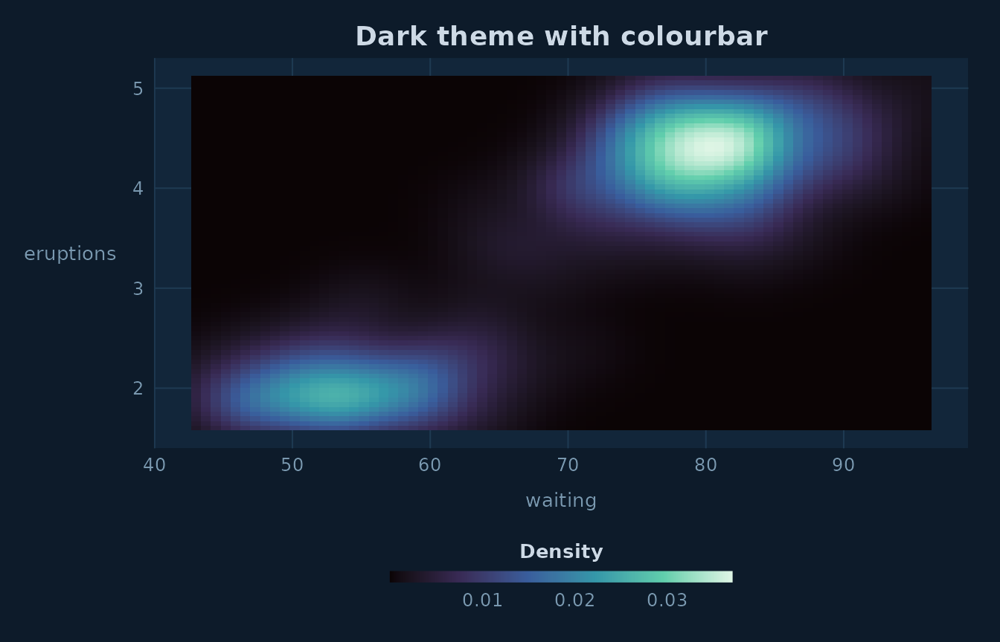

## OBIS logo overlay — `obis_add_logo()`

[`obis_add_logo()`](https://iobis.github.io/obis-recipes/reference/obis_add_logo.md)
overlays the OBIS and IOC logos at any corner of a finished plot using
`cowplot`. Pass `fig_asp = width / height` to match the dimensions you
plan to use in
[`ggsave()`](https://ggplot2.tidyverse.org/reference/ggsave.html).

``` r

p_light <- ggplot(mtcars, aes(wt, mpg)) +
    geom_point(color = "#0072B2", size = 2) +
    labs(title = "Fuel efficiency", subtitle = "Weight vs. miles per gallon",
         x = "Weight (1000 lbs)", y = "MPG") +
    theme_obis()

obis_add_logo(p_light)
```

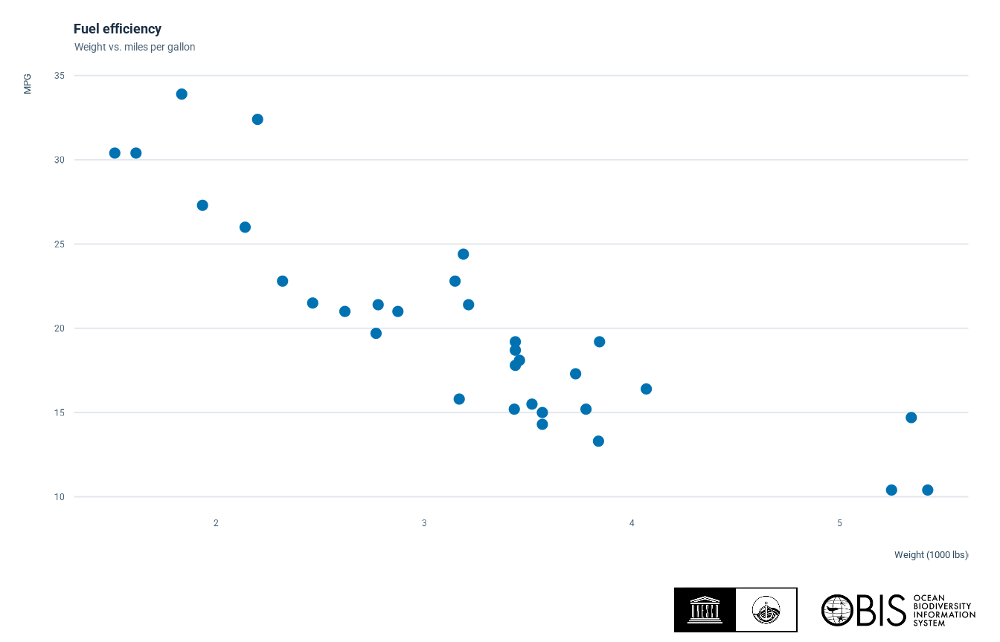

``` r

obis_add_logo(p_light, position = "bottomleft")
```

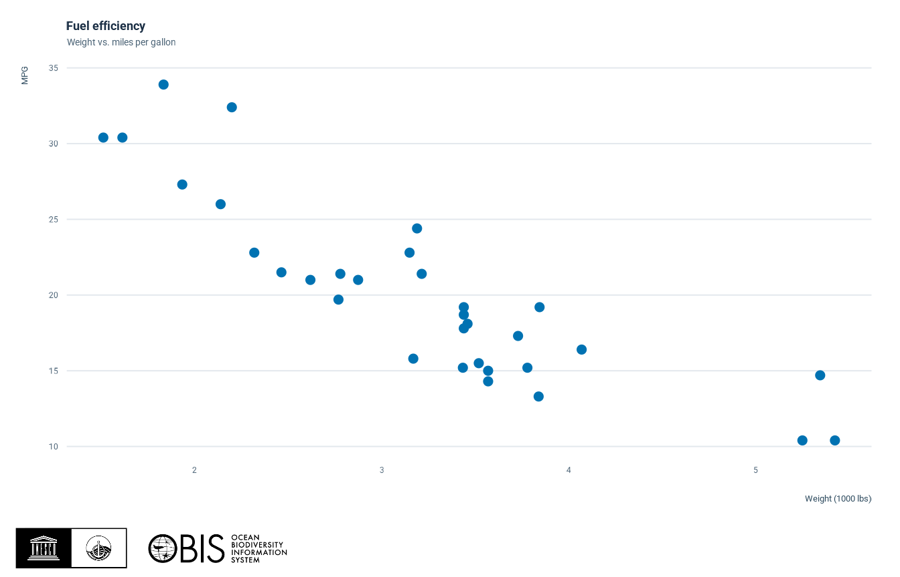

``` r

obis_add_logo(p_light, position = "topright")
```

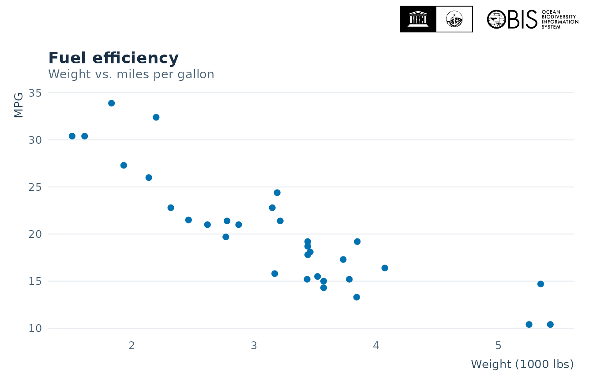

``` r

obis_add_logo(p_light, logo_size = 0.10)
```

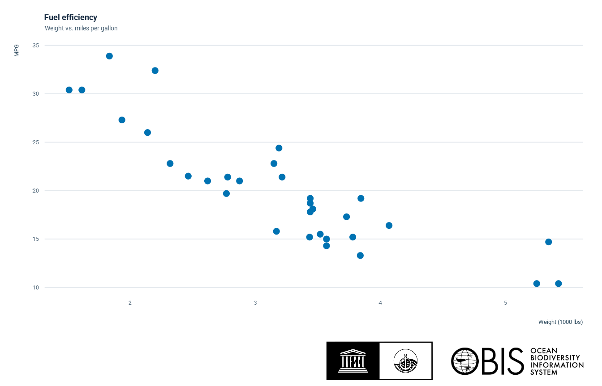

The `fig_asp` argument corrects logo proportions to match a specific
output size (e.g. 8 × 6 inches):

``` r

obis_add_logo(p_light, fig_asp = 8 / 6)
```

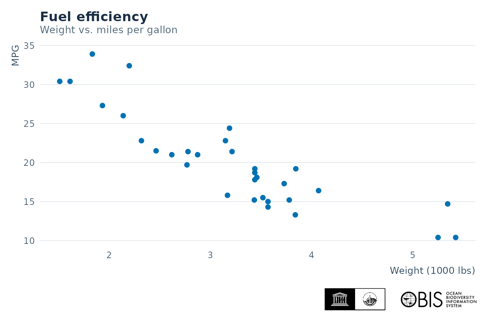

Logos also work on dark theme plots:

``` r

p_dark <- ggplot(faithfuld, aes(waiting, eruptions, fill = density)) +
    geom_tile() +
    scale_fill_obis_cont("thermal") +
    guides(fill = guide_colourbar_h(title = "Density")) +
    labs(title = "Old Faithful eruption density",
         x = "Waiting time (min)", y = "Eruption duration (min)") +
    theme_obis_dark(legend_position = "bottom")

obis_add_logo(p_dark)
```

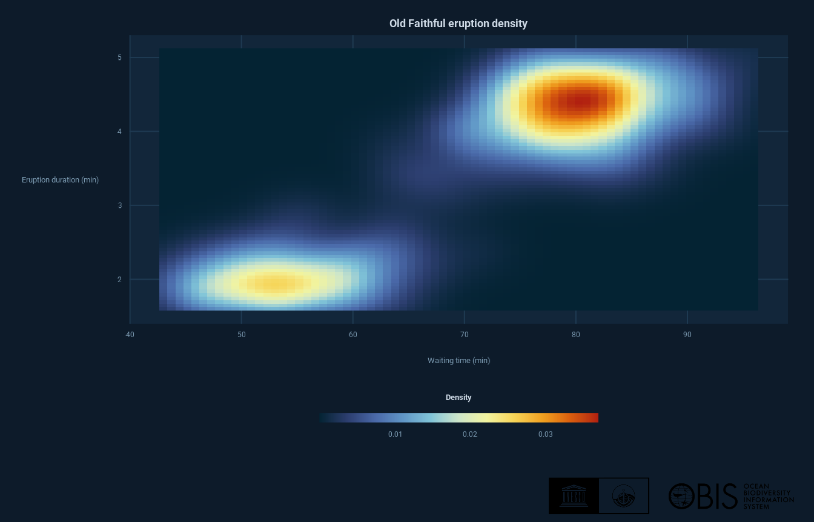

## Putting it all together

A combined plot mixing categorical shape and continuous color scales
with the horizontal colourbar:

``` r

ggplot(mtcars, aes(wt, mpg, color = hp, shape = factor(cyl))) +
    geom_point(size = 3) +
    scale_color_obis_cont("mako") +
    scale_shape_manual(values = c(16, 17, 18)) +
    guides(color = guide_colourbar_h(title = "Horsepower",
                                     barwidth = grid::unit(8, "lines"))) +
    labs(title = "Combined scales", x = "Weight", y = "MPG",
         shape = "Cylinders") +
    theme_obis(legend_position = "bottom")
```

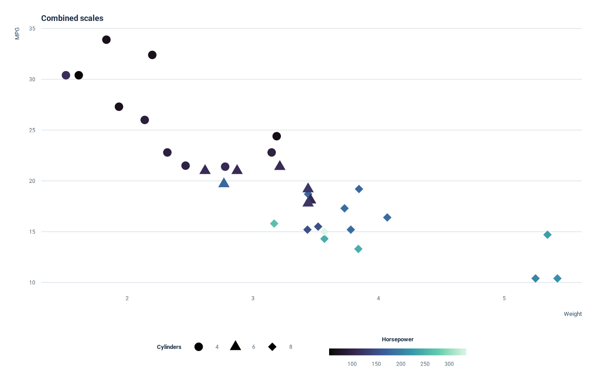

A full dark marine look with title, subtitle, and caption:

``` r

ggplot(faithfuld, aes(waiting, eruptions, fill = density)) +
    geom_tile() +
    scale_fill_obis_cont("thermal") +
    guides(fill = guide_colourbar_h(title = "Density")) +
    labs(
        title    = "Old Faithful eruption patterns",
        subtitle = "Kernel density estimate",
        caption  = "Source: R datasets",
        x = "Waiting time (min)", y = "Eruption duration (min)"
    ) +
    theme_obis_dark(legend_position = "bottom")
```

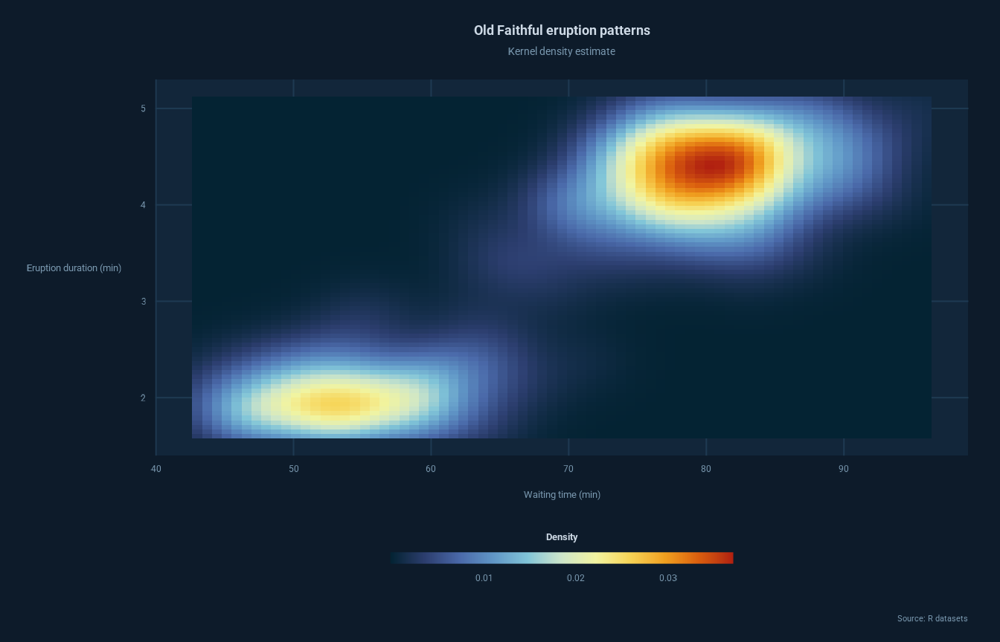
