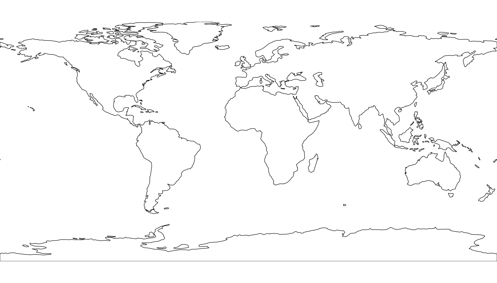
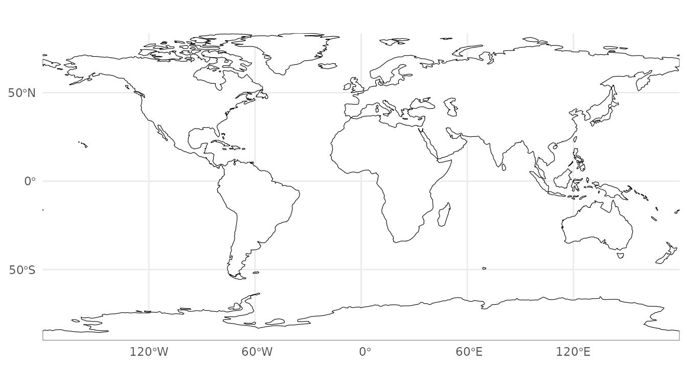
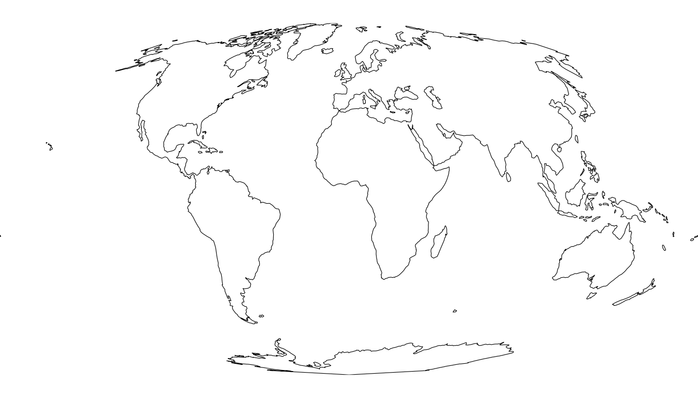
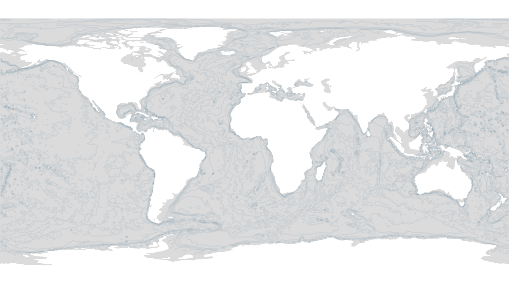
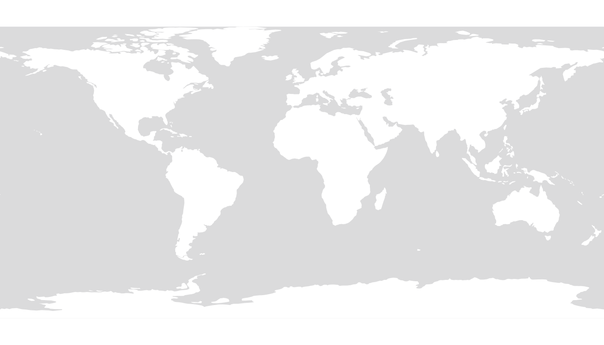
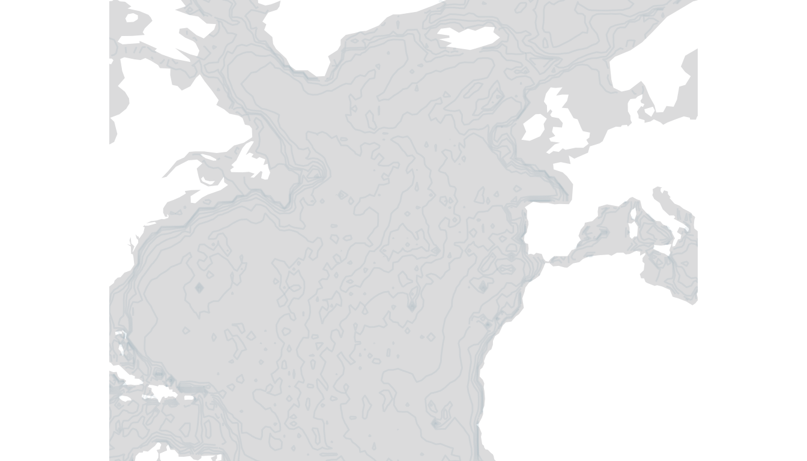

# Static Maps

``` r

library(obisrecipes)
library(ggplot2)
```

The static-map functions build ggplot2 world maps layer by layer. The
workflow is:

1.  Create a basemap with
    [`blank_map_s()`](https://iobis.github.io/obis-recipes/reference/blank_map_s.md)
    or
    [`grey_map_s()`](https://iobis.github.io/obis-recipes/reference/grey_map_s.md).
2.  Convert raw occurrence records to a spatial grid with one of the
    `occ_to_*grid()` helpers, or fetch pre-gridded data from OBIS.
3.  Overlay the grid with
    [`add_species_data_s()`](https://iobis.github.io/obis-recipes/reference/add_species_data_s.md).

## Basemaps

### Blank white map

``` r

blank_map_s()
```



Keep the graticule for maps where coordinate reference is important:

``` r

blank_map_s(keep_graticule = TRUE)
```



Any PROJ string can be passed to `map_crs`:

``` r

blank_map_s(map_crs = "+proj=moll")
```



### Grey OBIS-style map

[`grey_map_s()`](https://iobis.github.io/obis-recipes/reference/grey_map_s.md)
replicates the style used on OBIS taxon pages: grey ocean, white land,
and a semi-transparent GEBCO bathymetry overlay.

``` r

grey_map_s()
```



Disable bathymetry when it is not needed:

``` r

grey_map_s(add_bathymetry = FALSE)
```



Regional views are controlled with `plot_xlim` / `plot_ylim`:

``` r

grey_map_s(plot_xlim = c(-80, 20), plot_ylim = c(10, 70))
```



## Grid converters (offline)

These functions convert a data frame of occurrence records (columns
`decimalLongitude` and `decimalLatitude`) into an sf polygon layer with
one polygon per occupied grid cell.

``` r

occ_mock <- data.frame(
    decimalLongitude = c(-122.4, -118.2, -87.6, 2.3, 151.2, -43.1, 18.4, 103.8),
    decimalLatitude  = c(37.8,   34.1,   41.9,  48.9, -33.9,  -22.9, 59.3,  1.3)
)
```

### Geohash grid

``` r

occ_to_geohashgrid(occ_mock)
#> Simple feature collection with 8 features and 2 fields
#> Geometry type: POLYGON
#> Dimension:     XY
#> Bounding box:  xmin: -123.75 ymin: -35.15625 xmax: 151.875 ymax: 60.46875
#> Geodetic CRS:  +proj=longlat +datum=WGS84 +no_defs
#>     ID                       geometry records
#> 75c  1 POLYGON ((-43.59375 -23.906...       1
#> 9q5  2 POLYGON ((-119.5312 33.75, ...       1
#> 9q8  3 POLYGON ((-123.75 36.5625, ...       1
#> dp3  4 POLYGON ((-88.59375 40.7812...       1
#> r3g  5 POLYGON ((150.4688 -35.1562...       1
#> u09  6 POLYGON ((1.40625 47.8125, ...       1
#> u6t  7 POLYGON ((18.28125 59.0625,...       1
#> w21  8 POLYGON ((102.6562 0, 102.6...       1
```

``` r

occ_to_geohashgrid(occ_mock, grid_res = 4)
#> Simple feature collection with 8 features and 2 fields
#> Geometry type: POLYGON
#> Dimension:     XY
#> Bounding box:  xmin: -122.6953 ymin: -33.92578 xmax: 151.5234 ymax: 59.41406
#> Geodetic CRS:  +proj=longlat +datum=WGS84 +no_defs
#>      ID                       geometry records
#> 75cm  1 POLYGON ((-43.24219 -23.027...       1
#> 9q5c  2 POLYGON ((-118.4766 33.9257...       1
#> 9q8z  3 POLYGON ((-122.6953 37.7929...       1
#> dp3w  4 POLYGON ((-87.89062 41.8359...       1
#> r3gx  5 POLYGON ((151.1719 -33.9257...       1
#> u09w  6 POLYGON ((2.109375 48.86719...       1
#> u6t1  7 POLYGON ((18.28125 59.23828...       1
#> w21z  8 POLYGON ((103.7109 1.230469...       1
```

### H3 hexagonal grid

``` r

occ_to_h3grid(occ_mock)
#> Simple feature collection with 8 features and 1 field
#> Geometry type: POLYGON
#> Dimension:     XY
#> Bounding box:  xmin: -122.9976 ymin: -34.45959 xmax: 152.6023 ymax: 59.96206
#> Geodetic CRS:  WGS 84
#>   records                       geometry
#> 1       1 POLYGON ((18.26105 59.69862...
#> 2       1 POLYGON ((1.882244 49.80503...
#> 3       1 POLYGON ((-87.52625 42.1529...
#> 4       1 POLYGON ((-121.7645 37.6756...
#> 5       1 POLYGON ((-118.0404 33.9461...
#> 6       1 POLYGON ((103.858 1.093918,...
#> 7       1 POLYGON ((-43.12481 -23.832...
#> 8       1 POLYGON ((152.6023 -33.997,...
```

``` r

occ_to_h3grid(occ_mock, grid_res = 4)
#> Simple feature collection with 8 features and 1 field
#> Geometry type: POLYGON
#> Dimension:     XY
#> Bounding box:  xmin: -122.6357 ymin: -33.99678 xmax: 151.5703 ymax: 59.42504
#> Geodetic CRS:  WGS 84
#>   records                       geometry
#> 1       1 POLYGON ((18.40377 59.38198...
#> 2       1 POLYGON ((2.249146 49.03622...
#> 3       1 POLYGON ((-87.52625 42.1529...
#> 4       1 POLYGON ((-122.2748 37.5600...
#> 5       1 POLYGON ((-118.0404 33.9461...
#> 6       1 POLYGON ((103.858 1.093918,...
#> 7       1 POLYGON ((-43.25915 -23.149...
#> 8       1 POLYGON ((151.5336 -33.8956...
```

### A5 pentagonal grid

``` r

occ_to_a5grid(occ_mock)
#> Simple feature collection with 8 features and 1 field
#> Geometry type: POLYGON
#> Dimension:     XY
#> Bounding box:  xmin: -132.3253 ymin: -36.13236 xmax: 152.5101 ymax: 62.29494
#> Geodetic CRS:  WGS 84 (CRS84)
#>   records                       geometry
#> 1       1 POLYGON ((22.09166 57.81563...
#> 2       1 POLYGON ((-84.19662 44.4558...
#> 3       1 POLYGON ((-129 31.83236, -1...
#> 4       1 POLYGON ((-125.7545 36.2401...
#> 5       1 POLYGON ((-45.08435 -18.344...
#> 6       1 POLYGON ((-1.522731 56.8707...
#> 7       1 POLYGON ((146.3633 -36.1323...
#> 8       1 POLYGON ((98.36003 1.013697...
```

``` r

occ_to_a5grid(occ_mock, grid_res = 4)
#> Simple feature collection with 8 features and 1 field
#> Geometry type: POLYGON
#> Dimension:     XY
#> Bounding box:  xmin: -123.7136 ymin: -34.26582 xmax: 153.0125 ymax: 62.29494
#> Geodetic CRS:  WGS 84 (CRS84)
#>   records                       geometry
#> 1       1 POLYGON ((15 62.29494, 15.6...
#> 2       1 POLYGON ((-89.98879 41.0546...
#> 3       1 POLYGON ((-117.7574 33.6036...
#> 4       1 POLYGON ((-120.0985 40.0151...
#> 5       1 POLYGON ((-47.47328 -23.505...
#> 6       1 POLYGON ((2.781486 47.27974...
#> 7       1 POLYGON ((149.7741 -31.3520...
#> 8       1 POLYGON ((101.6882 0.506195...
```

## Preparing grid data for plotting

[`prepare_grid_data()`](https://iobis.github.io/obis-recipes/reference/prepare_grid_data.md)
bins a numeric `records` column into ordered factor levels matching the
OBIS colour breaks, ready for
[`scale_fill_manual()`](https://ggplot2.tidyverse.org/reference/scale_manual.html).

``` r

prepare_grid_data(occ_to_geohashgrid(occ_mock))
#> Simple feature collection with 8 features and 3 fields
#> Geometry type: POLYGON
#> Dimension:     XY
#> Bounding box:  xmin: -123.75 ymin: -35.15625 xmax: 151.875 ymax: 60.46875
#> Geodetic CRS:  +proj=longlat +datum=WGS84 +no_defs
#>     ID                       geometry records records_binned
#> 75c  1 POLYGON ((-43.59375 -23.906...       1             10
#> 9q5  2 POLYGON ((-119.5312 33.75, ...       1             10
#> 9q8  3 POLYGON ((-123.75 36.5625, ...       1             10
#> dp3  4 POLYGON ((-88.59375 40.7812...       1             10
#> r3g  5 POLYGON ((150.4688 -35.1562...       1             10
#> u09  6 POLYGON ((1.40625 47.8125, ...       1             10
#> u6t  7 POLYGON ((18.28125 59.0625,...       1             10
#> w21  8 POLYGON ((102.6562 0, 102.6...       1             10
```

Custom break thresholds:

``` r

prepare_grid_data(occ_to_geohashgrid(occ_mock), breaks = c(1, 5, 50, 500, 5000))
#> Simple feature collection with 8 features and 3 fields
#> Geometry type: POLYGON
#> Dimension:     XY
#> Bounding box:  xmin: -123.75 ymin: -35.15625 xmax: 151.875 ymax: 60.46875
#> Geodetic CRS:  +proj=longlat +datum=WGS84 +no_defs
#>     ID                       geometry records records_binned
#> 75c  1 POLYGON ((-43.59375 -23.906...       1              5
#> 9q5  2 POLYGON ((-119.5312 33.75, ...       1              5
#> 9q8  3 POLYGON ((-123.75 36.5625, ...       1              5
#> dp3  4 POLYGON ((-88.59375 40.7812...       1              5
#> r3g  5 POLYGON ((150.4688 -35.1562...       1              5
#> u09  6 POLYGON ((1.40625 47.8125, ...       1              5
#> u6t  7 POLYGON ((18.28125 59.0625,...       1              5
#> w21  8 POLYGON ((102.6562 0, 102.6...       1              5
```

## Fetching data from OBIS (requires internet)

[`get_occ_gridded()`](https://iobis.github.io/obis-recipes/reference/get_occ_gridded.md)
retrieves raw occurrence records via the OBIS API and converts them to a
spatial grid.
[`get_occ_tiles()`](https://iobis.github.io/obis-recipes/reference/get_occ_tiles.md)
uses the pre-aggregated tile endpoint — much faster for large taxa.

``` r

# Whale shark (taxonid 141438)
grid_geohash <- get_occ_gridded(taxonid = 141438, type_grid = "geohash", grid_res = 3)
grid_h3      <- get_occ_gridded(taxonid = 141438, type_grid = "h3",      grid_res = 3)
grid_a5      <- get_occ_gridded(taxonid = 141438, type_grid = "a5",      grid_res = 3)

# With date filter
grid_recent <- get_occ_gridded(
    taxonid   = 141438,
    startdate = "2010-01-01",
    enddate   = "2024-12-31",
    type_grid = "geohash",
    grid_res  = 3
)
```

``` r

tiles       <- get_occ_tiles(taxonid = 141438, grid_res = 3)
tiles_r4    <- get_occ_tiles(taxonid = 141438, grid_res = 4)
tiles_dated <- get_occ_tiles(
    taxonid   = 141438,
    startdate = "2020-01-01",
    enddate   = "2024-12-31",
    grid_res  = 3
)
```

## Plotting occurrence grids

[`add_species_data_s()`](https://iobis.github.io/obis-recipes/reference/add_species_data_s.md)
overlays a spatial grid on an existing basemap. By default it zooms to
the bounding box of the data.

``` r

blank_map_s() |>
    add_species_data_s(grid_data = grid_geohash)
```

Pass `auto_breaks = TRUE` to let ggplot2 choose break thresholds
automatically:

``` r

grey_map_s() |>
    add_species_data_s(
        grid_data   = grid_h3,
        auto_breaks = TRUE
    )
```

Global view without zooming to the data extent:

``` r

grey_map_s() |>
    add_species_data_s(
        grid_data     = tiles,
        limit_by_bbox = FALSE
    )
```

Custom breaks, colours, and no legend:

``` r

blank_map_s() |>
    add_species_data_s(
        grid_data = tiles,
        breaks    = c(1, 5, 50, 500),
        colors    = c("#f7fbff", "#6baed6", "#2171b5", "#084594"),
        legend    = FALSE
    )
```

Regional view — Indo-Pacific:

``` r

grey_map_s(plot_xlim = c(30, 160), plot_ylim = c(-40, 35)) |>
    add_species_data_s(
        grid_data     = tiles,
        limit_by_bbox = FALSE,
        plot_xlim     = c(30, 160),
        plot_ylim     = c(-40, 35)
    )
```
